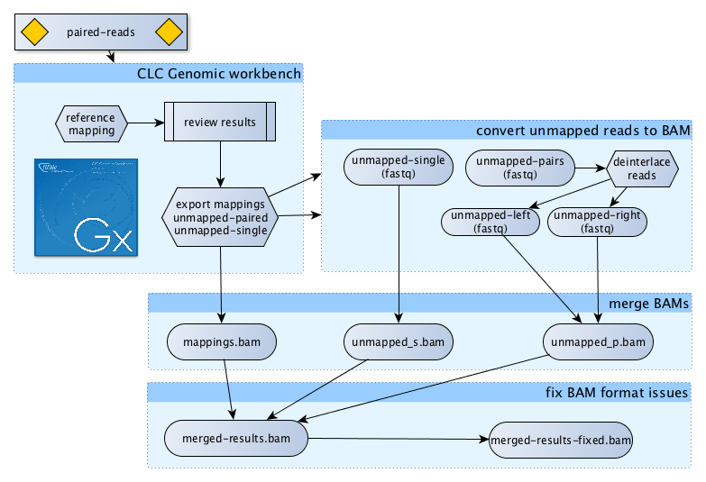

 - NGS-Tools
========
## Analysis tools

### **locus2genes**

A script using R packages to query biomaRt and fetch genes in a given locus (loci) before computing GO enrichment on the gene list. Please read the [dedicated page](locus2genes/README.md) for more info.

## Formatting tools for FASTA data

### **restrict2bed.pl**

The BIO-perl script [restrict2bed.pl](fasta-tools/restrict2bed.pl) will parse a multifasta file and look for one or several combined RE sites on both strands; matches are reported in BED format to be used with BedTools (requires BioPerl and several cpan modules to work, see header).
```bash
## Usage: restrict2bed.pl <-i fasta-file>
# <-n 'nicker(s)', multiple allowed separated by ',')>
#  'Nt-BspQI' => 'GCTCTTC',
#  'Nt-BbvCI' => 'CCTCAGC',
#  'Nb-BsMI'  => 'GAATGC',
#  'Nb-BsrDI' => 'GCAATG'
# Additional optional parameters are:
# <-l minimal length for dna sequence (20000)>
# <-h to display this help>
```

### **fasta2chromsizes.pl**

The BIO-perl script [dedupFastaSeq.pl](fasta-tools/fasta2chromsizes.pl) create a file reporting chromosome lengths from a multifasta file. Such file is required for BedTools to operate on intervals (requires BioPerl for parsing fasta).
```bash
## Usage: fasta2chromsizes.pl <-i fasta-file>
# Additional optional parameters are:
# <-l minimal length for dna sequence (20000)>
# <-h to display this help>
```
### **dedupFastaSeq.pl**

The BIO-perl script [dedupFastaSeq.pl](fasta-tools/dedupFastaSeq.pl) will parse a multifasta file and keep only one copy of each sequence based on its name (no sequence comparison is operated). Requires BioPerl to work.
```bash
## Usage: dedupFastaSeq.pl <fasta_input file> <output file name>
```

### **fastaFiltLength.pl**

The BIO-perl script [fastaFiltLength.pl](fasta-tools/fastaFiltLength.pl) will filter a multifasta file and keep only sequence with length > min and <max values. Was created to filter genome assemblies containing multiple small files.
```bash
## Usage: fastaFiltLength.pl <-i fasta_file (required)>
# Additional optional parameters are:
# <-o outfile_name (filtered_)>
# <-m minsize (undef)>
# <-x maxsize (undef)>
# <-h to display this help>
```

### **fastaSortLength.pl**

The BIO-perl script [fastaSortLength.pl](fasta-tools/fastaSortLength.pl) will sorts a multifasta file by decreasing or increasing order. It also allows filtering by size and exclude sequences that woulsd be too small or too large. Was created to clean input fasta files before applying Knicker (BionanoGenomics).
```bash
## Usage: fastaSortlength.pl <-i fasta-file> <-o size-order ('i'=increasing | 'd'=decreasing)>
# Additional optional parameters are:
# <-m minsize (undef)>
# <-x maxsize (undef)>
# <-h to display this help>
```

## Formatting tools for FASTQ data

### **fastq_detect.pl**

The perl script **[fastq_detect.pl](fastq-tools/fastq_detect.pl)** is parsing n-lines of fastQ data to identify the range of ascii score used and matching them to what is expected for the main flavors known today. The result is a list of compatible fastQ versions.
```bash
## Usage: fastq_detect.pl <fastq file> <opt:sample-size (100)>
```

### **CLC-to-BAM**

The bash script **[CLC-to-BAM.sh](fastq-tools/CLC-to-BAM.sh)**  takes a BAM file and two fastq files containing unmapped reads (paired and single, all tree files were exported from a CLC genomic reference mapping experiment) and combines them all into ONE BAM file. Some validation and fix are applied but the BAM is not 100% clean (although sufficiently for GCAT analysis).



### **avgQdist2linePlot.R**

The R script **[avgQdist2linePlot.R](fastq-tools/avgQdist2linePlot.R)** is taking output from the popular [fastx toolkit](http://hannonlab.cshl.edu/fastx_toolkit/) to plot a normalized line graph (PDF) of base frequencies. This once was needed to identify base bias across reads. One example output is saved [here](pictures/avgQdist2linePlot.png).

### **isFastqUniq.sh**

The awk script **[isFastqUniq.sh](fastq-tools/isFastqUniq.sh)** is parsing fastQ data to identify duplicate read names and prints out names of reads present more than once. This is a very basic script.

### **deduplicateFastq.pl**

The perl script **[deduplicateFastq.pl](fastq-tools/deduplicateFastq.pl)** is parsing two paired fastQfiles (can be flat or .gz) and filters out reads found more than once based on their exact names. This script was developped for data extracted from BAM that presented the same reads multiple times due to alternate mapping results. The script will end if pair sync is not valid (same name for both mates) or if fastq 4-line structure is lost.

## Formatting tools for SAM / BAM data

### **uniq_mappings.pl**

The Perl **[uniq_mappings.pl](bam-tools/uniq_mappings.pl)** is reading from a **name-sorted** BAM file (*verified from the presence of 'SO:queryname' in the first header line*) and outputting 'uniquely mapped' and 'multiple-mapped' reads to two separate **SAM** files with adapted headers.

Usage: This script was created to extract uniquely mapped reads from a public BAM file and convert the mapping data back to FastQ. The obtained reads where then re-mapped to another reference genome build.

### **bam_re-pair.pl**

The Perl **[bam_re-pair.pl](bam-tools/bam_re-pair.pl)** script gets data from a piped samtools command and filters paired reads only to create a new BAM file with help of samtools.

```
Usage: samtools view -h <name_sorted.bam> | 
	bam_re-pair.pl | 
	samtools view -bSo <name_sorted.filtered.bam> -
```

## Formatting tool for annotation data

### **bed2picard-list.sh**

Some Picard tools, like **CalculateHsMetrics** require list as input. The Picard list format is a hybrid format including a sam header and almost-BED data. The BED data has 5-columns and the start coordinate increased by 1 to reflect the 1-closed coordinate expectations of Picard. A simple bash script **[bed2picard-list.sh](bam-tools/bed2picard-list.sh)** was created to streamline the process of creating a list file from a **bed5** and **dict** files.


<h4>Please send comments and feedback to <a href="mailto:bits@vib.be">bits@vib.be</a></h4>

------------


This work is licensed under a [Creative Commons Attribution-ShareAlike 3.0 Unported License](http://creativecommons.org/licenses/by-sa/3.0/).
